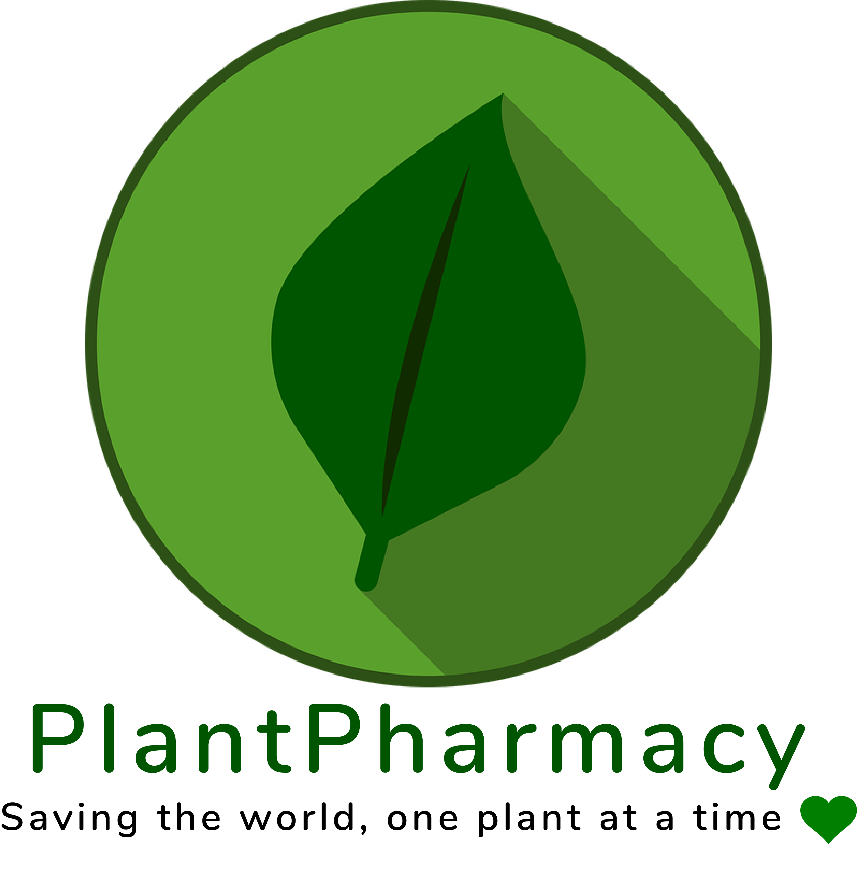

    

## Our Mission
PlantPharmacy's mission is to help users identify the plant disease and the suitable treatment with high accuracy and less confusion.

## Problem
Plants give us oxygen, provide food for all living organisms, and offer numerous benefits to human environments[3](https://www.treehugger.com/health/5-health-benefits-houseplants.html). Yet they are sensitive and die every day from various ailments that can be easily treated. Most people don’t know what causes the infection, what effects it has or what they can do to treat it.  Research into the cause may be painstaking or difficult. This hurts the efforts of an individual or organization to benefit from plants in a sustainable manner and also makes it expensive to replace plants that could have been saved. 

Sick plants may be suffering from a lack or overabundance of water, nutrients, or plant diseases caused by biotic agents or pathogens, such as fungi or bacteria. For most people, the problem is not obvious. There are some attempts at solving this information problem in the form of informational websites, forums, articles, books, and journals. All of these solutions thoroughly describe various types of plant diseases, the pathogens that cause them and how they could be treated or prevented. Some websites such as [Fine Gardening](https://www.finegardening.com/) do a better job of explaining different methods of treatment for different types of plant diseases. Despite these solutions, an individual struggles to identify the cause of the plant disease just by looking at it and hence he or she is unable to provide the appropriate treatment to the plant to save it and potentially prevent disease from spreading.

## Online Presence
http://plantpharmacy.app/
https://github.com/Plant-Pharmacy

## Team members 
- Kyra Bautista (CDO/PM)
    - kyrabb@uw.edu
- Mikias Lema (CDO)
    - mikias@uw.edu
- Alessandro Lou (Engineer)
    - alemau@uw.edu
- Adrian Lonescu (CEO/ Engineer)
    - aiones@uw.edu
- Pooja Ramanathan (CTO)
    - ps2112@uw.edu

## References
1. https://hortnews.extension.iastate.edu/2005/12-7/dis.html
2. https://pixabay.com/vectors/pokemon-type-element-design-symbol-3414810/
3. https://www.treehugger.com/health/5-health-benefits-houseplants.html
4. https://www.finegardening.com/
