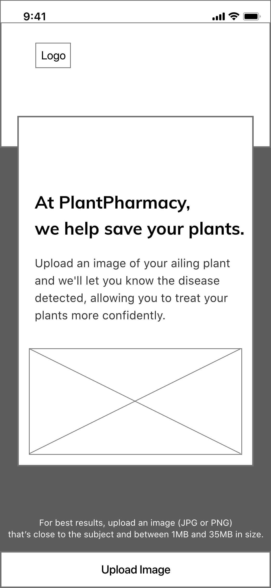
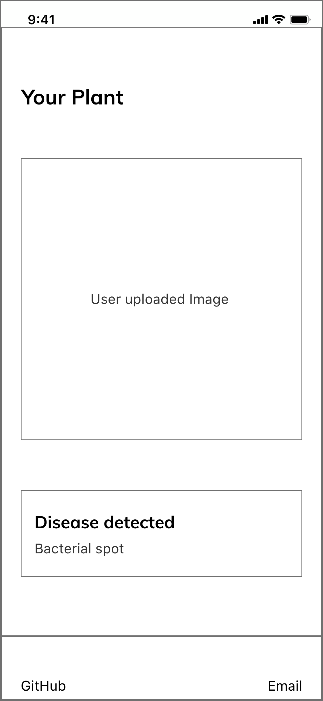
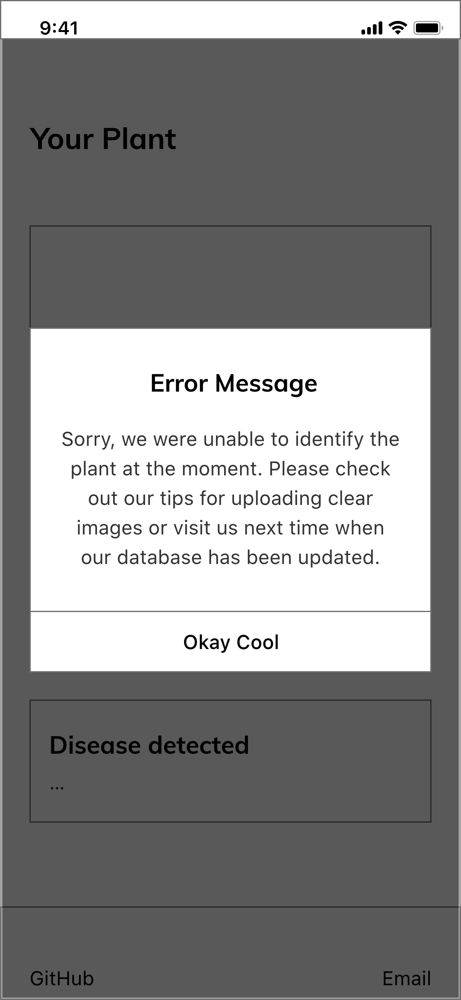

    

# PlantPharmacy Design Specification

## Problem
Plants are essential to our health. They provide us with clean air, absorb harmful toxins, produce nutrients for all living organisms3, and offer numerous benefits to our environment. Yet many plants are sensitive to various ailments and often die. Most people who may own or take care of an indoor or outdoor plant aren’t aware of the causes that start infections, what effects it has, or what they can do to treat it. Research into the cause may be painstaking or difficult. This hurts the efforts of an individual or organization to benefit from plants in a sustainable manner and also makes it expensive to replace plants that could have been saved.

## Solution
Give stakeholders a platform and the tools necessary to identify a pathological diagnosis to the plant's ailment. 

We envision a mobile web application that detects plant diseases based on user-uploaded plant images. Users can upload one image a time to receive information about the detected disease. Currently, our back end supports images of Tomato, Pepper, and Potato.

Plant Pharmacy's interface layout is responsive to user's screen size, and utilizes a consistent interface layout for cross-platform usage. Our user interface is very simple. We have a single page web application:

Users tap the upload button to upload a single image. For best results, users are recommended to upload an image (JPG or PNG) that’s close to the plant and between 1MB and 35MB in size. This upload button is fixed to the bottom of the browser so that users can have access to uploading a different image from anywhere on the page.

After a user uploads an image two things could happen:

File requirements are satisfied thus the user receives the "results screen" shown below. This "results screen" contains the loading state while processing an image, the original image uploaded by the user, and lastly, disease detected in text format.

File requirements are not satisfied thus the user receives the error screens shown below. 

 
